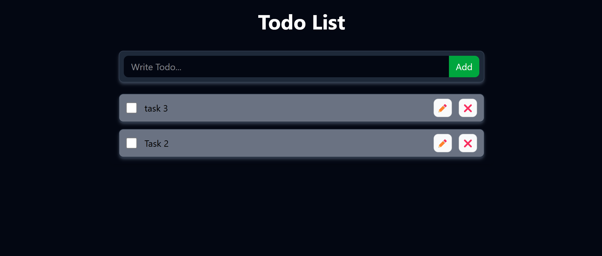

# 📝 React Todo App

A simple and clean Todo List application built with **React**. This app allows users to add, edit, complete, and delete todos, with persistent storage using **localStorage**.

## 🔗 Live Demo

👉 [View the Live App](https://mohammadzaid07.github.io/todo-react/)

## 📸 Preview

## 🚀 Features

- ✅ Add new todos
- 📝 Edit existing todos
- ☑️ Mark todos as completed
- ❌ Delete todos
- 💾 Persistent storage with localStorage
- 🎨 Responsive and minimal UI

## 🛠️ Tech Stack

- React
- Tailwind CSS (for styling)
- Context API (for state management)
